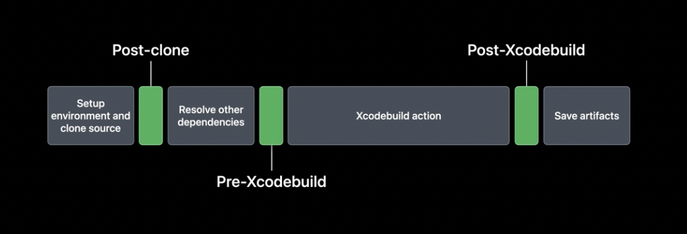
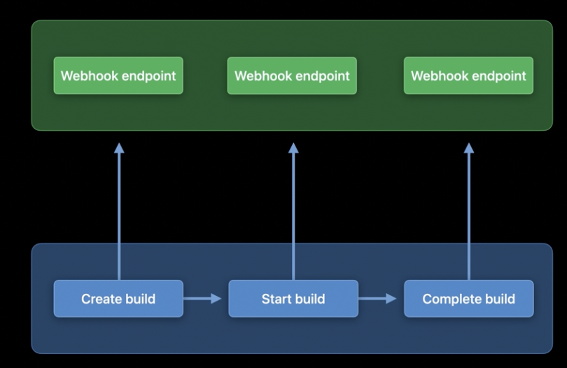
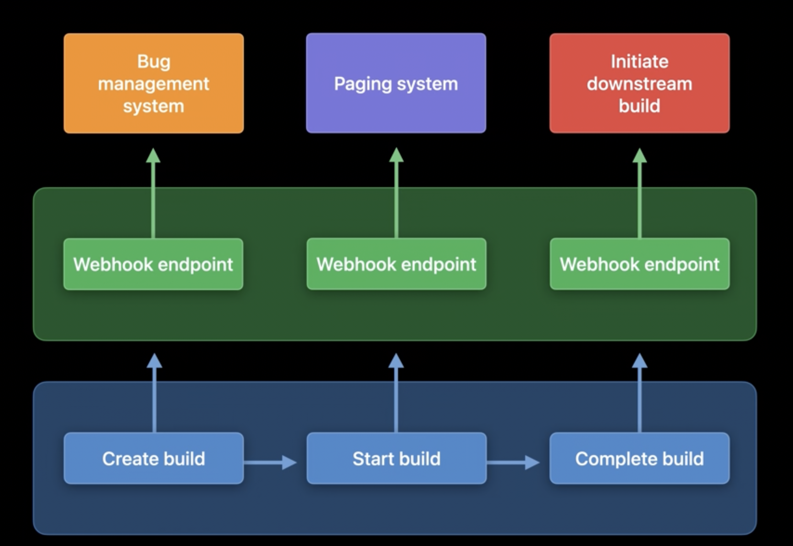

# Customize your advanced Xcode Cloud workflows

[Link](https://developer.apple.com/videos/play/wwdc2021/10269)

1. Environment Variables
2. Custom scripts
3. Additional repositories
4. Webhooks

## Environment Variables

If your app depends on an API service, you may want your tests to use a staging environment rather than production. In this case, you'd want to pass a different URL for the API service into your tests. Environment variables allow you to do just that.

Environment variables are simply key-value pairs that allow you to define some information that you can use to further control the behaviour of your build. You can configure any environment variables you need in the Environment section of your workflow. You don't need to commit any additional information to your source repository.

For sensitive information, like API keys or access tokens, you can configure a secret environment variable. Secret environment variables are handled securely. They're encrypted and stored securely at all times, and their decrypted values are only available in the temporary environments that are used to run your actions. The values are also redacted from logs, and you can't view them in the workflow editor like you can for a non-secret variable. Check the "Secret" checkbox in the environment variables table to make an environment variable secret. The value of the envvar will then be hidden from view and will be stored securely once you save your change. It will also no longer be viewable in the workflow editor.

We can customise behaviour and pass additional information into workflows with envvars. It's even more powerful in conjunction with "Custom scripts".

## Custom scripts

Sometimes, you'll need to run custom logic or additional commands during an action, and custom scripts provide a powerful and flexible way to achieve this. A custom script is a shell script that you write and include in your source repository. Your custom scripts are run in each of the actions in your workflow. There are three types of scripts available:

1. the post-clone script
2. the pre-Xcodebuild script
3. the post-Xcodebuild script.

Each time Xcode Cloud runs an action it performs a series of steps and each of the custom scripts, as hinted at by its name, is run as a step at a particular point in an Action.

1. Xcode Cloud sets up a temporary environment and clones source code from your primary repository.
2. Afterwards, Xcode Cloud runs the post-clone script.
3. After resolving all other source dependencies, Xcode cloud runs the pre-Xcodebuild script.
4. Next, Xcode Cloud runs the action's corresponding xcodebuild command.
5. When the Xcodebuild step finishes, Xcode Cloud runs the post-Xcodebuild script and saves any artefacts it generated earlier.



If your workflow includes several actions -- for example, multiple build actions -- or build, test, analyze, and archive actions -- Xcode Cloud runs your custom scripts at the appropriate times for each action.

Adding a custom script to Xcode Cloud is easy. You simply add a shell script with the appropriate name into a folder called "ci_scripts", and place this folder at the same level as the project file or workspace you're using in your workflow. Since custom scripts are part of your source code, you can test out script changes in pull requests or even customize their behavior on different branches.

ci_post_clone.sh

ci_post_xcodebuild.sh

ci_pre_xcodebuild.sh

When Xcode Cloud runs your actions, it looks for the existence of each of the scripts at the appropriate time and runs them if they're present. You don't need to configure your workflow to run your custom scripts. If the scripts are there, they'll be run. Do note that the name of the ci_scripts folder and the scripts inside must exactly match this naming convention in order for Xcode Cloud to find and run your scripts.


The CI_PRODUCT_PLATFORM variable gives you the OS type i.e. iOS, watchOS, tvOS or macOS.

If there's a command you only want to run during the archive action of a specific workflow, you can check that the CI_XCODEBUILD_ACTION and CI_WORKFLOW variables match the archive action and the specific workflow before running the command.

We can customise the app icon for distributing apps via a PR workflow.

1. Click + button at the bottom of the File Navigator in Xcode.
2. Add new group called ci_scripts.
3. Add the beta app icon set to the ci_scripts folder so that my custom script can swap it into place during the build.
4. Uncheck any selected targets when adding the app icon set, and click finish.
5. Add a pre-Xcodebuild script that runs prior to the Xcodebuild command. Uncheck any targets in the sheet. We can detect if the workflow is PR-based in multiple ways, but we check if the PR number has been set in this example. To run the script only if the app will be distributed to TestFlight, we can check if the XCODEBUILD action is archive.

```sh
#!/bin/sh

# ci_pre_xcodebuild.sh

if [[ -n $CI_PULL_REQUEST_NUMBER && $CI_XCODEBUILD_ACTION = 'archive' ]];
then
    echo "Setting Fruta Beta App Icon"
    APP_ICON_PATH=$CI_WORKSPACE/Shared/Assets.xcassets/AppIcon.appiconset
    
    # Remove existing App Icon
    rm -rf $APP_ICON_PATH
    
    # Replace with Fruta Beta App Icon
    mv "$CI_WORKSPACE/ci_scripts/AppIcon-Beta.appiconset" $APP_ICON_PATH
fi

```

6. Run the workflow!

## Custom Scripts

Logs from custom scripts are available in the Activity Log and in the Logs artifact. Double check you've named it correctly inside the ci_scripts folder if it's not being run.

Add logging and resiliency to custom scripts. If making network requests to external services you may want to retry those requests with verbose logging enabled.

Custom scripts exit codes are respected.

In a test action, multiple environments are used to build and run your tests. Source code is not available when running tests. Only the environment that is running your tests will have the source code cloned into it by default. The environments that run your tests won't have the source code cloned into them. They'll only have access to the ci_scripts folder.

## Additional repositories

Xcode Cloud helps to add additional repositories e.g. Swift Packages or Cocoapods.

1. Add Package from Xcode File menu and select Packages within your organisation.
2. Commit xcodeproj + Package.resolved changes to the repository.
3. Automatically trigger a build.
4. Go to ASC and grant access to the repository via Manage Repositories.
5. Click Grant button and follow steps to connect Xcode Cloud to the repository.
6. Rerun the build after Xcode Cloud has been granted access.
7. View all repositories Xcode Cloud has access to with Additional repositories menu in settings. You can also revoke access from there.

We have to do these steps for any Git operations including cloning a repository through a custom script or referencing a git submodules. This is valid for all dependency management tools.

Watch: Discover and Curate Swift Packages using Collections to learn more.

## Webhooks

Notify beta testers when a new build is ready using Webhooks.

- Allow further customization of your workflow.
- Send messages to an endpoint of your choice.
- Send at different moments of a build's lifecycle.

You can set up webhooks in Xcode Cloud to receive real-time updates at 3 different stages of your build.

1. Create build
2. Start build
3. Complete build



Adding webhooks is easy on Xcode Cloud.

1. Select Settings
2. Select Webhooks
3. `+` button
4. Enter name and URL to receive and handle HTTP requests for the Webhook. Save.

Upto 5 webhooks per product.


How can we set up a server to receive webhook requests? We can achieve this using Swift on an AWS Lambda.

```swift
// Handling the webhook from an AWS Lambda

Lambda.run { (context, request: APIGateway.V2.Request, callback: @escaping (Result<APIGateway.V2.Response, Error>) -> Void) in {
  let webhook = jsonDecoder.decode(Webhook.self, Data(request.body.utf8))
  
  if webhook.workflow.content.name == "Release Workflow" &&
     webhook.buildDetails.build.state == .succeeded {
       twitterClient.post(content: """
       🚀 Build #\(webhook.buildRun.number) of \(webhook.app.name) is available for testing!
       Get it here: <Testflight public link>
     """
     )
  }
  return callback(.success(APIGateway.V2.Response(statusCode: .ok)))
}
```

Watch: Use Swift on AWS Lambda with Xcode

If your endpoint doesn't return a successful exit code, Xcode Cloud will try to send the request again. Xcode Cloud also makes it easy to inspect the contents of your web hooks delivered to your endpoint.

1. Go to ASC Settings
2. Go to Webhooks
3. Select Desired Webhook
4. Inspect request

### Example Webhook flows



Automatically create or resolve bugs in bug tracking system, send notifications to a paging system when a build fails, initiate downstream builds as part of a complex release workflow.