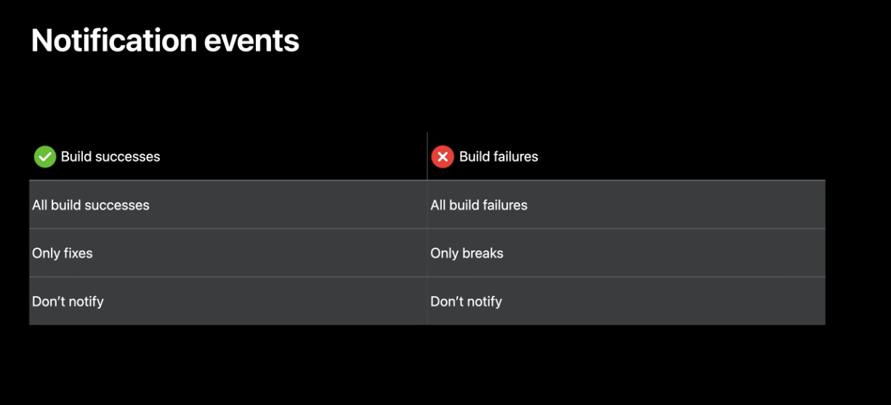
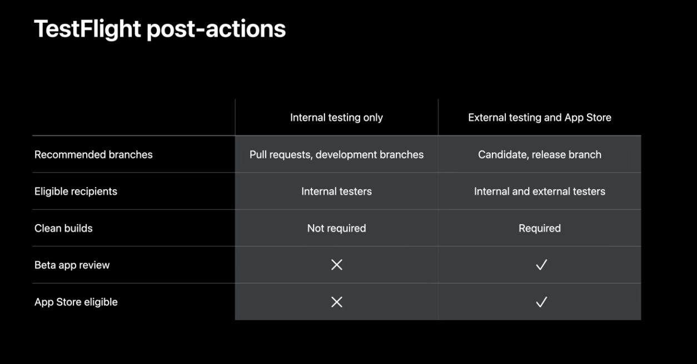

# Explore Xcode Cloud Workflows

[Link](https://developer.apple.com/videos/play/wwdc2021/10268/)

Automate building, analysing, archiving, testing and distributing your apps and frameworks.

1. Start conditions
2. Set up environment
3. Configure actions
4. Configure post-actions
5. Recommended strategies

Pull request workflow

- Runs for every pull request
- Analyze, test, and archive my app
- Notify my developer team
- Deliver my app to team members

Start condition types:

Every change to a branch, tag, PR or on a schedule

We can build files incrementally in Xcode Cloud, however, we may want to perform a clean build, as required for Testflight or App Store builds.

We can add environment variables for configurations and secrets we don't want to check in to the source code repository. We can also mark Env Vars are secret for extra security.

Watch: Distribute apps in Xcode with Cloud Signing for how to distribute builds from within Xcode.

We can automatically analyse the code every time we make a code change.

Post-actions: sending notifications, or distributing.

We can also add release branch external build workflows, as well as overnight scheduled testing builds (UI tests, Smoke tests, Unit tests and Analyze steps).

Release workflow:

1. Start condition: changes to 'release' branch
2. Execute a full set of tests
3. Runs archive
4.  Deploys to external TestFlight group

Overnight testing workflow:

1. Runs on a schedule
2. Runs on many simulators, multiple platforms
3. Notifies the QA team on failure
4. No deployment