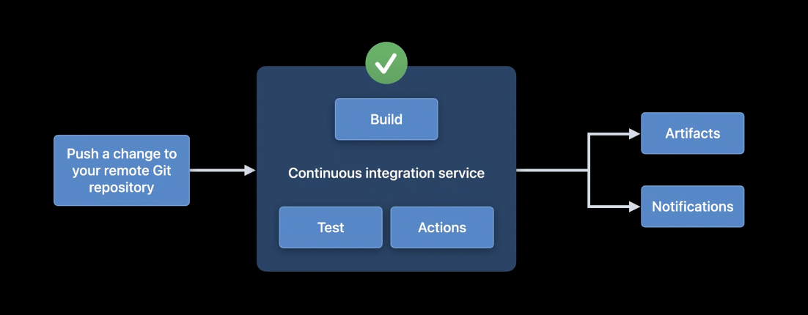
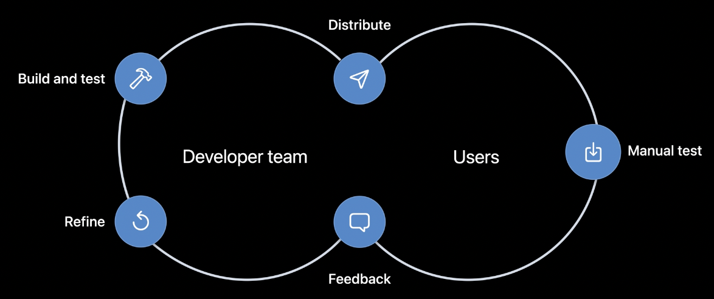
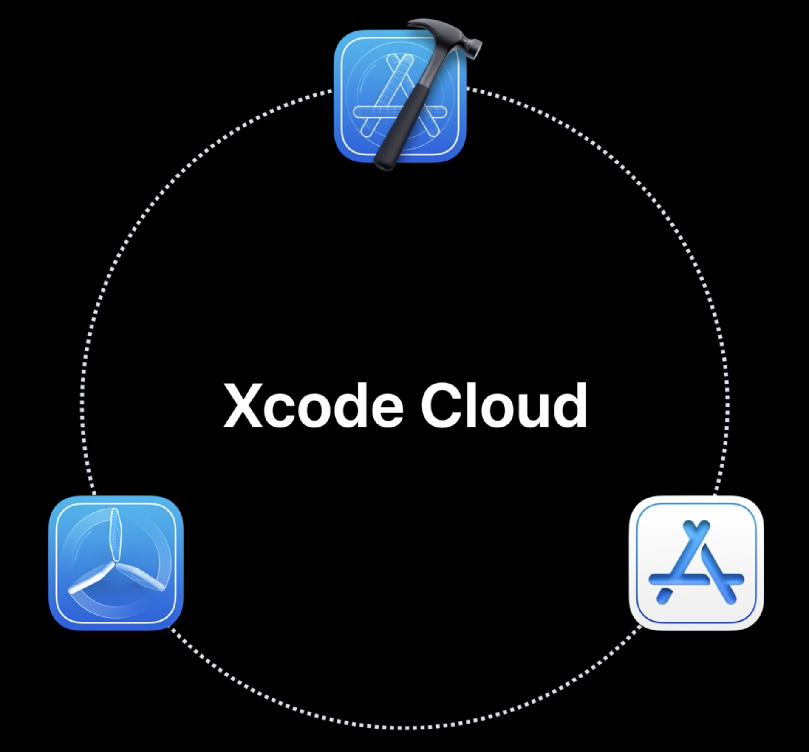
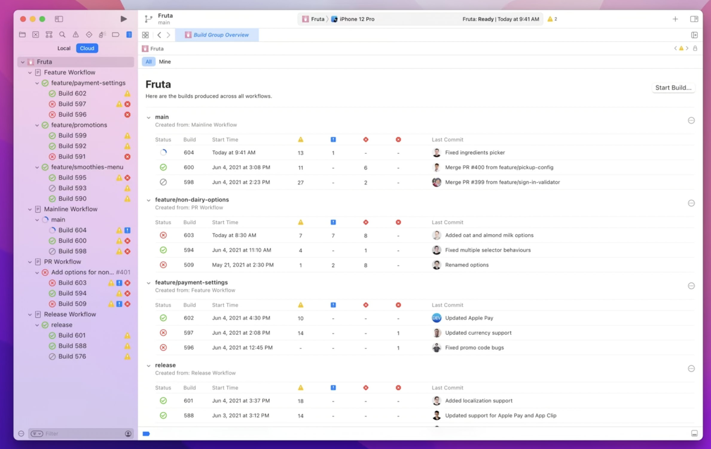
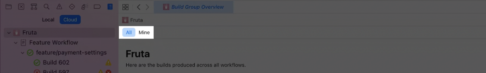

# Meet Xcode Cloud

[Link](https://developers.apple.com/videos/play/wwdc2021/10267/)

​	The result of running a workflow is called a build.

Xcode Cloud runs builds in Apple-managed cloud infrastructure that provides code signing and access to multiple OS versions and Xcode releases.

We can see the status of all workflows and the latest builds in the Xcode sidebar. Clicking your app also opens the Build Group overview showing all the builds organised by the way your development team works by workflow and git branch. We can use 1 workflow for many branches but still see the results separately.

We can see the builds triggered only by us, using the Mine filter in the Overview, or by selecting the person icon in the report navigator (bottom of the sidebar).

We can see the build report for a single run of a workflow by clicking on a single build. This is where you can deep dive into the results specific to your code change. You can view test reports, logs and jump directly into the code that caused an issue.

Everything we just saw is not only available in Xcode, it’s also available in App Store Connect. This includes starting and viewing builds, managing workflows, viewing and downloading artifacts, sharing results with your team, and managing notification settings. And if you’re already working in TestFlight, Xcode Cloud is the tab right next door in App Store Connect for quick access.

In App Store Connect, you can also set up your personal notification settings. I like to set up Slack notifications for failing builds so I can continue working after pushing my code but get alerted quickly if there’s something to fix. Everyone on your team can set up notifications that work best for them.

Xcode Cloud ensures your data is protected.

Workflows are made up of:

1. Start Condition
2. Environment
3. Actions
4. Post-Actions

## Steps to get started

1. Product -> Xcode Cloud -> Create Workflow
2. Select desired target
3. Edit workflow if needed
4. Grant source code access via GitHub, BB etc.
5. Grant access using steps provided on ASC.
6. Register app and bundle ID to ASC.
7. Start 1st build.

## Notes

We can also see logs and artefacts for single builds.

Check out the source code of a build on the top right, or rebuild the run.

We can use the jump-to button in the errors menu to jump to the error-causing line in Xcode.

## Collaborate with your team

We can see all the workflows and builds from the rest of our team.

We can edit Workflows with the Edit Workflow button. We can add a more descriptive name "Releases" since we're going to be building and testing a couple of branches we use for our releases.

We can click the + button to add an additional source branch 'release/v1'.

We can also add Test actions. We need to add devices to run on to ensure the tests can run. Clicking once on the + button we get Recommended iPhones, and clicking twice gives us Recommended iPads.

We can also edit devices to use a specific device. We can also change the OS version button.

Then we save our changes.

Select "start build" by right-clicking a workflow to manually trigger a workflow. We can then select the branch we want to trigger.